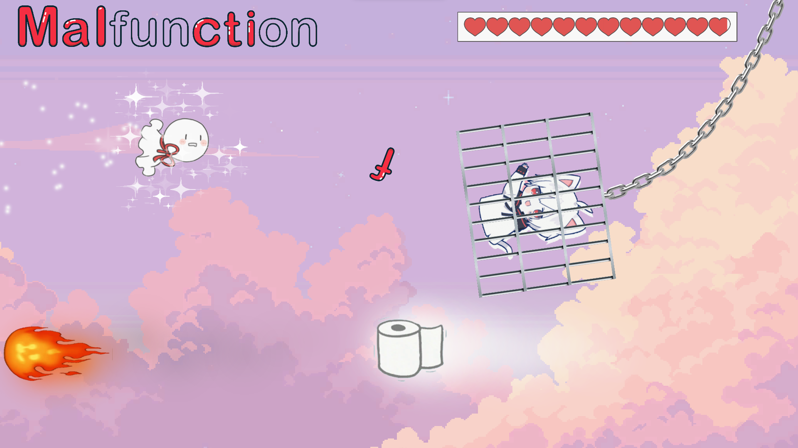
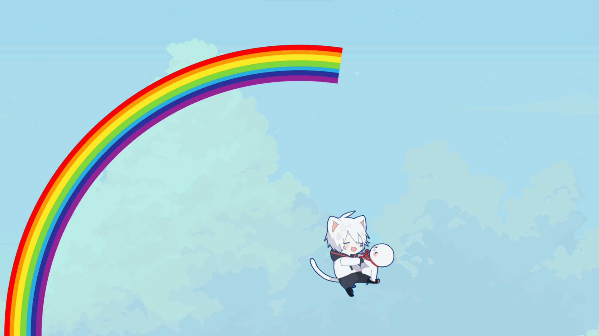
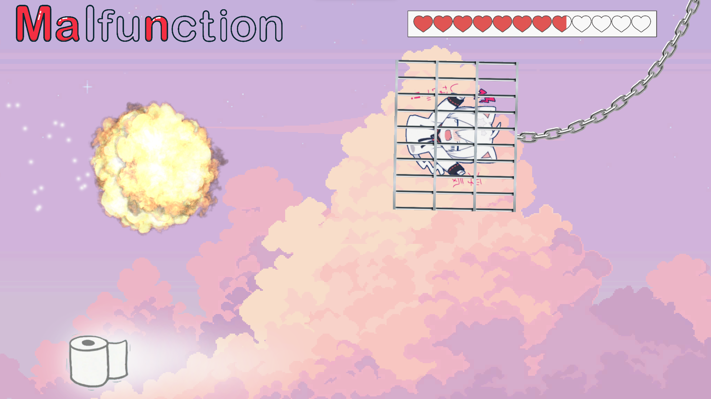
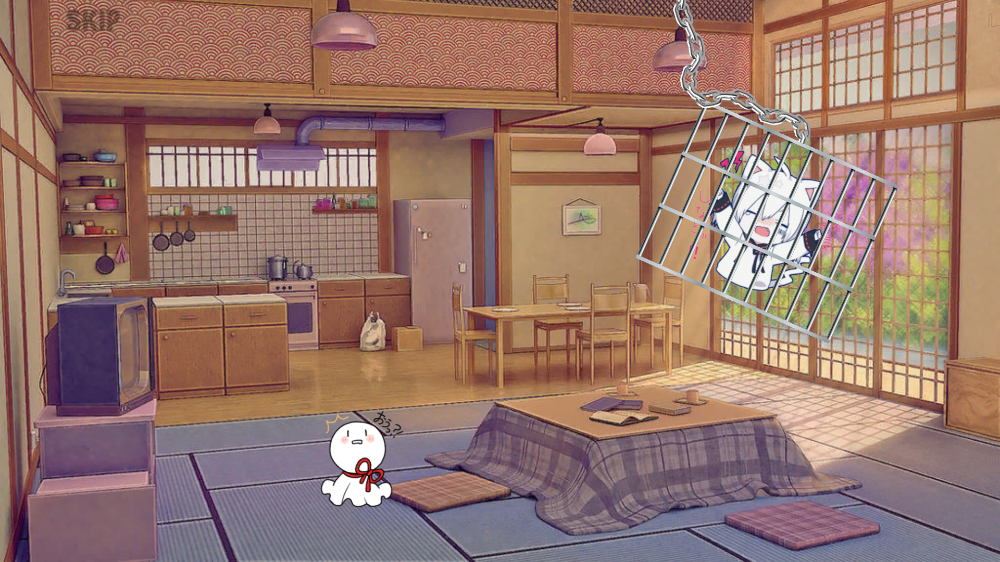
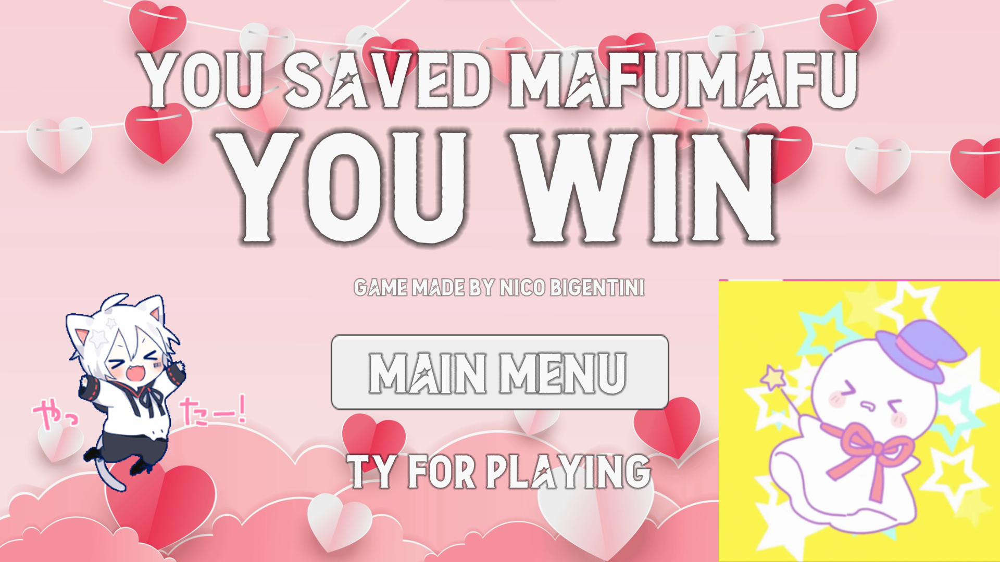

# Save Mafumafu - Mafuteru Flying Game
<a href="https://lenibi.github.io/Mafuteru-Flying-Game/">Click Here To Play</a>
#### Please allow some loading time! Project may take from 5 seconds to a minute to load. 
Works best on a PC 1080p 16:9 screen. Runs on mobile horizontally but not as well. On mobile, rotating screen orientation may break the game.

## Gameplay Showcase
(https://youtu.be/HJl8d4lF8Bg)

## Description

A game about my favourite japanese singer Mafumafu and his mascot Mafuteru. Mafumafu is taken away in a cage, and Mafuteru flies to save him!

Includes UI, start animation, flying physics, rope physics, Unity's Particle system, animation, sound and more.

## How to play

* Hold down the mouse left click to fly
* Health decreases when touching the ground, ceiling, or hitting a fireball
* Eat tissues to refill health
* Collect all the letters that Mafumafu throws to win, spelling out the name of the song!
  
